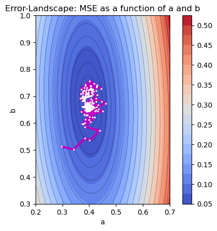

# ai-nb

This repository provides a collection of Jupyter notebooks for artificial intelligence problems.

## How to view online
You cannot view the notebooks with github due to size restriction. To view the notebooks online use the link: [Nbviewer - schbm/ai-nb](https://nbviewer.com/github/schbm/ai-nb)
